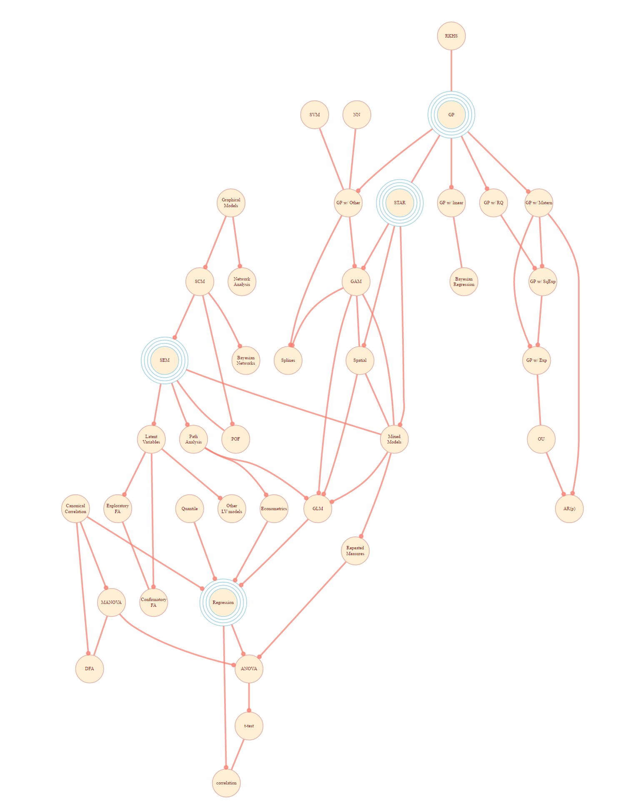

# Connections

Connections among various statistical methods. Note that in these depictions, no attempt is made to graph all possible connections, or there would be some relation among almost all techniques.  Rather, a specific perspective is chosen, and any simplifying steps to keep the graph clean are taken.  Overviews in specific docs provide further context.

Currently on hold as a recent Diagrammer update removed functionality and altered functions that made this process much simpler.

